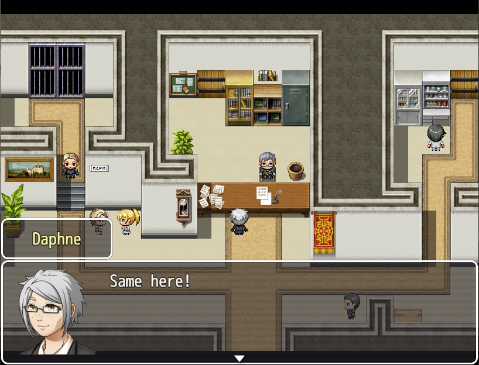
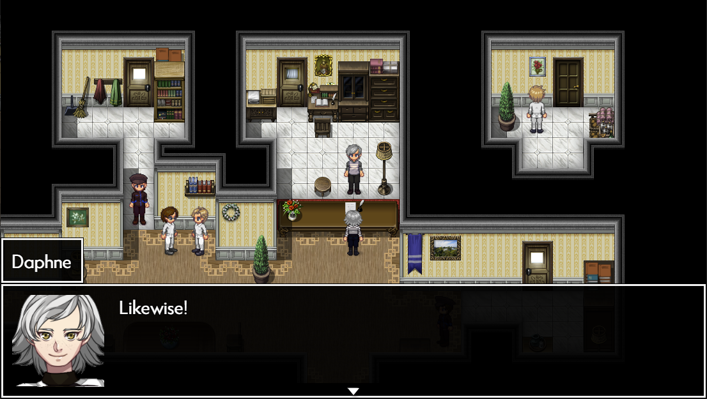
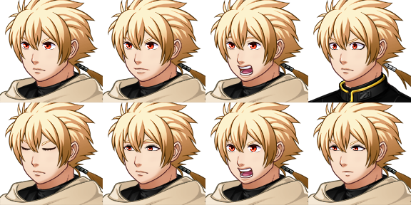
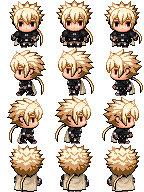
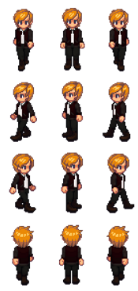
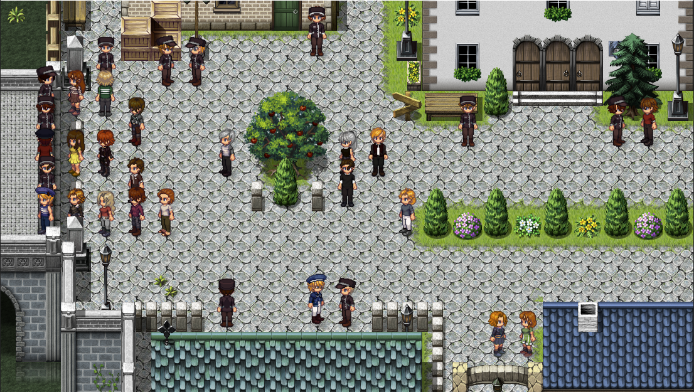

# Premortem

Hey  fellas,
it's Saturday the 24th July.** One week from now, Trachi 1.2 will be released.**
Since this will probably the biggest update the game has ever received, I want to use this opportunity to take a look  at some of the roadblocks and tough decisions I've had to face during the course of development.
I also had a few in-depth talks with some of the testers, recently. 
On one hand, I received a lot of compliments and encouragements. And while I'm thankful for that, I here want to focus on a the parts of the game that they rightfully pointed out as being flawed.
**For this reason, I will not only cover game specific stuff, but also talk about general approaches to game design** **and project management**. 

An emphasis will be put on **heuristic decision making **and **path dependencies**. To illustrate my considerations, I will showcase examples from project T during various stages of development.
That being said, let's start of with a comparison.
<!-- more -->

 **Below, you'll find a very old version (circa 2019) of the first map that the game places you in:**

**And to contrast, the current version (July 2021):**
As you can see, a lot has changed. Now, I'm not one to judge which version looks better. But the important thing for me is that the current iteration is a much better **representation of how I intended the game to look**, in the first place.

The reason why I'm showing this area, in particular, is because it's the** first thing a player sees after starting a new game**. But it's also an area that I might have never remade, if I decided that my time is better invested in further parts of the game. 

**The underlying question is: "Was it worth it?"**
## Division of labour
Back when I uploaded this project to itch, I made [a lengthy post](https://noury.itch.io/trachi/devlog/266671/a-decade-of-trachi) detailing the creation process of Trachi, going back almost ten years. That post is only a month old, but it feels like an eternity ago. 
At that point, I had already updated the prologue with the tilesets from the main game, in contrast to my initial plans.

Back then, Act 1 was highly unfinished, while the prologue was still struggling to find it's place in the encompassing narrative. The original roadmap had me wrap up and release the three acts of the main game and then go back to the prologue.
The reason why I'm referring to this is because it ties into a big, general question that has to be repeatedly answered during the course of every mid- to long-term project: **"Should I use the limited time I have to work on the old, or the new?"**
It is a question so elementary that every human is faced with it repeatedly during their lives. Not only in a professional context, but also in personal matters. 
 On one end of the spectrum lies fanatical perfectionism, unable to push forward and thus incapable of ever finishing anything.
 On the other end is a half-finished soup of ideas that never got the chance to flourish. 

Without a doubt, I am naturally inclined much more to the former, than the latter.  However, I also have a tendency to bounce between those two extremes. A professor of mine once non-nonchalantly said to me: **"You're a person with a lot of great ideas. But once in a while, people like you need a kick up their creative butt."**
He was right.  At least I think so. The problem was that I tried to do a lot of things at once, so I never had the resources to focus on a specific aspect and give it the attention it deserved.
**In terms of Trachi**, I knew that I wanted to tell a story, first and foremost. I'm not a great artist, nor did I have any experience in the development of games. I've played video games since I was five, but never actively build one, until then.
If you've ever worked in event-management,  you know how different your perception is to someone who's simply a guest at the very same event. 
**There's always an urge to look behind the curtains, but there's also a reason why those curtains are there, in the first place. **
 It is to separate a light form of enjoyment from hard and scrupulous work that always involves cutting corners left and right.
But enough rambling. Back to the point.
## The old
One month ago, I was faced with a decision. I always planned to update the characters to be more in line with the narrative. For reference, this is one of Ganymede's the old facesets and walking sprites:

Both were generated using the default generator in RMMV. And while I was content with them for the longest time, I increasingly felt that they became more and more inappropriate with the overall theme of the game. 

The baseline of RMMV is a fantasy RPG in which people kill slimes, buy weapon upgrades & potions, to then restore their HP/MP by lying in a bed for thirty seconds to a good-night jingle.
**Trachi, on the other hand, is a game about abstract concepts that were especially pronounced from modernity onwards. **

The early 20th century, which the game is loosely based on, was a time of increased industrialisation, transportation and electrification, in technological terms. In cultural terms, Europe was still mostly dominated by empires that had claimed a significant part of the world for themselves.

 However, mass politics, national identities and social issues were starting to usher in widespread changes. Socialism rose from a paradigm to an actual form of government and Fascism established itself as a widespread alternative to existing form of governance, as well.

 **
The point is, that the narrative had outgrown the representation of the characters. **
## The new
In early July, I had a more or less complete game that just needed a lot of refining on my hands, but certain aspects of it were dragging it down, significantly. The release dates were however already set, more or less. So I was very reluctant to make significant changes that would require me to spend weeks just to fix a certain aspects.
In my mind, there was never a question of whether I'd give certain characters a remake, and others not. 
**I was adamant that, if I remodelled the characters, every single one had to be remade in the same style.**

Since the prologue had already been released (and I was set on not remaking the overarching narrative), I tried to stay as true to the original characters, as I could. On the other hand, I wanted to fulfil the original goal of developing a style that would fit into the narrative.
After two and a half weeks spent in character generators and gimp, I'm now at a point at which I'm satisfied with most of the characters, barring minor flaws. Since pictures say more than a thousand words, see the new Ganymede, below:

Now, it probably depends on your perspective, and I'm sure there's at least one person who prefers the old set to the new one. And that's perfectly valid opinion to have. But I personally am much more fond of the new ones.

 **More importantly, however, they blend themselves much better into the world they're placed in.**
## Closing thoughts
I think it's clear that my point here is much less: "old bad - new good". On the contrary, neither of those pairs are universally fixed to each other, in any direction.
The question is much more **what kind of elements are emphasized and how well they fit togethe**r. I could have bended the narrative to fit the characters. In fact, I did so during many instances, in the past.
But in the end, I decided to go back and remake considerable portions of the game. 

**I always knew Trachi would get good, eventually. **
My biggest fear is players getting discouraged before they'll even have a chance to see immerse themselves into a world I've spent more than a thousand hours on, already.
Even though there are undoubtedly segments in the game that I am incredibly proud of, other parts are still nagging me.
As for now, though, I'm going to let the prologue rest for a while (for real, this time!) and focus on finishing Act 1, which will be publicly available for the first time from next Saturday, onwards. 
Contrary to the prologue, its segments were designed around the new tilesets. I thus expect  much less post-release polishing to be required on the main game, but one can never be absolutely sure, when it comes to that.
To close it off, I want to show you one more comparison between two iterations of the same area.
 **The eastern checkpoint**, which is the quasi hub of the prologue, was the first area I designed in the revived Trachi project. It has thus seen countless variations and will likely be subjected to a lot of refining, in the future, as well.

**Below, you can see the oldest version of it I could dig up (circa 2018)**.
 If I'm not mistaken, it has never been released to the public, since I remade significant parts of before the legacy build of the prologue was released.

**And the current version, to be released along Trachi 1.2:**

So to finally answer the question I posed, initially: 
**
In my opinion, it was worth it.**

Thank you very much for your attention and interest. I hope I was able to shed light on some of the challenges I've had to face during the last three and a half years of development. And I am very much looking forward to hear your own experiences, as well.

Much love, as always, 
Nory
