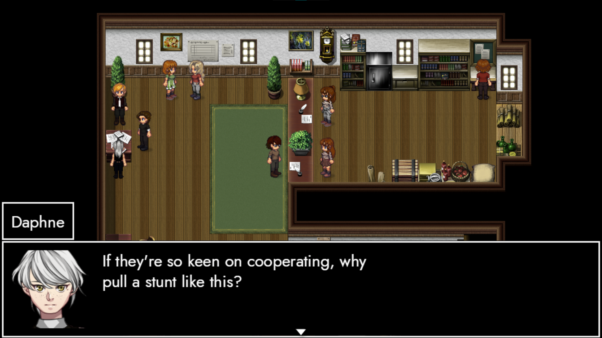
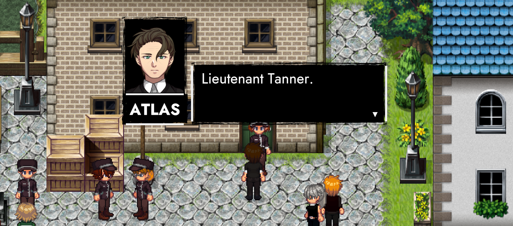
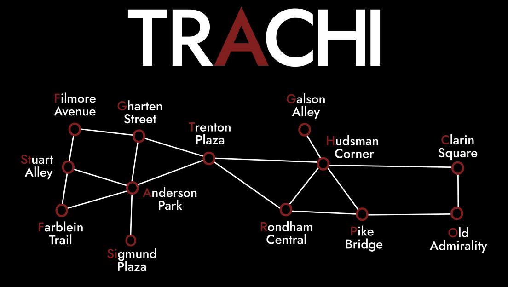

# ProAgon

## Hey Friends! 👋

**I hope you had a stellar start of the year!**

As you recall, we made a big [**announcement**](https://store.steampowered.com/news/app/1811440/view/527581830427181968) in December. Here's the recap: We're porting AUTONOMY to ANARCHY! It's a big project and a major confrontation with the past.

To understand what we're dealing with, we'll take several pit-stops throughout this year. Our first impression hones in on the **prologue**. We'll talk about the good, the bad and the quirky. At the end of it, we pose a single question:

*What do we keep, add or rearrange?*

## Method

Let's state the obvious: Good and bad are bound by perspective. Any part of AUTONOMY could be irreplaceable to someone, while someone else might find it cringe. One way to deal with that discrepancy is to forgo other people's opinion and stick with your own.

It's my go-to strategy for **conceptual** stuff. I have a clear vision of a scene, people and happenings. If I was content on dreaming dreams by myself, this is where I'd stop. A mind full of ideas, mayhaps a tiny prototype. No builds. No TRACHI. No clout. 
<!-- more -->

In reality, I translate thoughts into **shapes** and present them to you. A lot of ideas never find a matching form – mostly due to time constraints. AUTONOMY is no exception. The things we convey within the game(s) are the peak of a tip of an iceberg. 

So what do we do to ameliorate that? We try to understand the plot points of AUTONOMY and how well they're represented in the game. Starting with the scene that every player saw.

## Wenger [1926]

We find ourselves in a foyer filled with slow and somber music. There's people in uniform, military and medical. A conversation between our current Protagonist (Daphne) and the institution's receptionist about formalities marks TRACHI's first conversation.

Our way through the western-wing makes us overhear more **dialogue**. Two guardsmen, one of them is voicing his discontent. His view on the working conditions within a mental asylum is met by a counterpoint: There's far worse places out there.

Finally, we arrive in a capsule of a room. It's neatly decorated, but the walls are closing in. A single window is the only indicator that there's a whole **world** out there. Daphne asks the cell's inhabitant if it's alright for her to step inside.

Two people in a room. The recipe that constitutes 95% of AUTONOMY's buffet. However, the scene in front of us is special. Most of the sentences are in past or perfect tense. [How we got here](https://tvtropes.org/pmwiki/pmwiki.php/Main/HowWeGotHere) is the name of a game where all roads lead to the past.

## Buildup & Payoff

1923, to be precise. Three people in a carriage, a bit of banter flows into a brief. The names (Daphne and Ganymede) give us continuity but the mood is wildly different. Something bad must've happened between 1923 and 1926. Our expectation is as follows: We'll see what that bad thing is.

Truth be told, I don't think AUTONOMY fulfilled that **promise**. If we assume that's the case: Would that be bad? I guess it depends on how much you value payoffs. From a designer's perspective, I can tell you as much: I bit off more than I could chew.

So, how do we fix it? There's two possible avenues. Either we fill the gap between 1923 and 1926, or we adjust the mood in 1926. Option B might take away from the experience of our introductory scenes, whereas the first option would require some kind of major **happening**.

As of today, I can't give you a definite answer as to which road we'll take. Though if you sneak a peek at InvAsion/ANARCHY, you might see that there's already a world-shattering event in our inventory. Whether we pull that ace or come up with something new – we'll see. For now, let's go back to 1923.

## Checkpoint

After disembarking the carriage we move through a border area and end up at Trachi's eastern gate. This was the first scene I made – and it's filled to the brim with **exposition**. Dialogue continues to be our main form of communication. We hear about rules, regulations, customs, time and anxiety.

The core message of the first hour spent in the **outskirts** of Trachi goes like this; There's some kind of plan (or arrangement), but things aren't panning out. Atlas in particular externalizes the difference between expectation and reality with growing frustration. Whatever plot our three protagonists are up to, it's falling apart in front of us.

In hindsight, we could call it self-referential. I remember going for [kafkaesque](https://www.merriam-webster.com/dictionary/Kafkaesque). Whether that worked or not is ultimately up to you – but I'd like to tell you my position either way.

Pruning this goose-chase of a prologue has been on my mind for a long time. The segment between Tanner and Julius is important for the following acts, but the sequence itself isn't up to snuff. You see how it's precisely the inverse problem of what we talked about in regards to 1926?

## Back and Forth

Let's apply that logic to the entire prologue. I have a bunch of scenes ready to sprinkle throughout AUTONOMY. For example, there's a conversation between Icarus and Ariadne about whether to run and abandon the city, take out Daphne and Atlas or stick with Orpheus' plan. We'd get a great **counterpoint** to confirm that the bureaucratic hoops we're jumping through are – in fact – deliberate.

On the flip-side, we have a scene of Daphne rummaging through Ganymede's apartment in Aion. I wasn't sure whether to set this post-AUTONOMY, but now I'd like to put this a few weeks prior. If you played InvAsion, you already saw a bit of the **operational setup** between Atlas and Daphne. We'll probably split this intermission and end it on Daphne's call to liquidate Ganymede on August 26th.

I think at this point it's clear what needs to be done. The biggest problem is that the prologue doesn't convey the **stakes**. There's a lot of potential to tease the characters' intentions and how far they're willing to go. If we manage to impart that to somebody on their first play-through, I can't imagine them not wanting more.

As for the concrete placement: There's a bunch of **intermissions** where Ganymede is interrogated. Since these were more or less a crutch to facilitate exposition, we could make these optional. Speaking of non-obligatory content: Let's talk a word or two about interactivity!

## Paths

As we know, AUTONOMY's isn't exactly diverse when it comes to the ways it can unfold. It's a linear story that sacrifices branching paths for pacing and **coherence**. I'm content to stick with that formula and rely on other ways to make your individual experience more unique.

The good news is: We won't have to start from scratch. TRACHI's story works by conveying information through an anachronistic sequence and expects you to assemble a **timeline** in your head. By far and large the most efficient way to enhance that process is to add complementary pieces of lore all over the place. I'm talking newspapers, bulletins, books, diaries and every other medium that holds a word or two.

Overall, a lot of **characters** that deserve more love. I already mentioned Icarus and Ariadne. Let's add to that the Nestville community, namely: Tilian, De Bloom and Julius. The same goes for Tanner, Heinrich and other individuals in the Trachian citizenry. 

Maybe the locality of the prologue presents us with a unique chance to focus on the **dynamics** between Nestville, the DMZ and Trachi's law enforcement. Wouldn't it be great if people in Trachi proper were apprehensive of that little enclave? In contrast, we could hammer home another point: Most people in Nestville want to go back into the city – whereas others like their new life in the DMZ.

## /Thread

<iframe allowfullscreen="" frameborder="0" src="https://www.youtube.com/embed/cxdU0xPErHE"></iframe>

To sum up: We don't need to extend the timeline or wander off into new avenues (barring the 1923 <-> 1926 dilemma). Almost all of our changes either rearrange or add extra paths between existing threads. The overall framework remains the same, but the network will be a denser version of itself.

We'll put a special focus on **arteria's preparation** (showing all sides this time), sidelined characters and geopolitical history by squeezing in as much lore as we can. If you have anything you'd like to see in particular, you're naturally welcome to chime in.

One way or the other, AUTONOMY will get the technical foundation it deserves. Add to that the fact that the entire TRACHI **family** is packaged as a single application. We'll talk more about that and other technical details in the coming days. If all goes well, we can tackle the narrative side of AUTONOMY's first act sometime in April.

Until then, please accept my heartfelt thanks for your attention – both in-game and here!

Have an awesome couple of weeks, Friends! 🤗

**much love**  
nory
